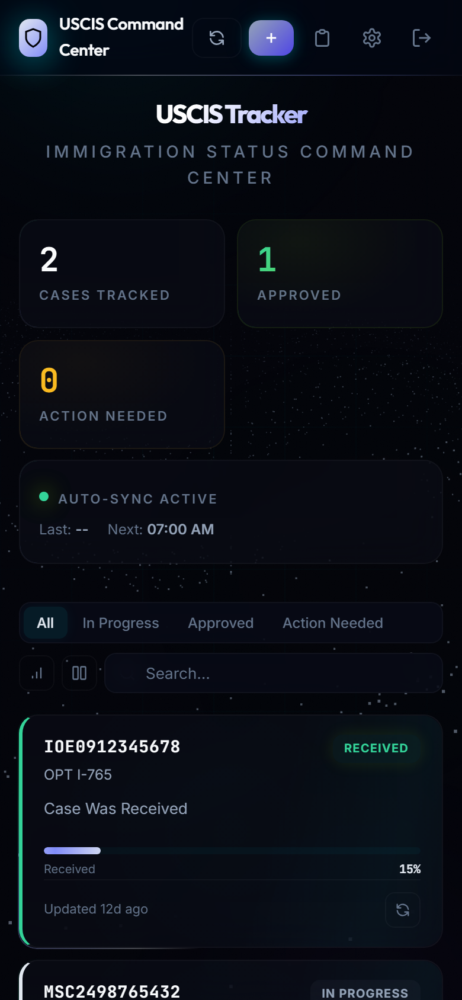
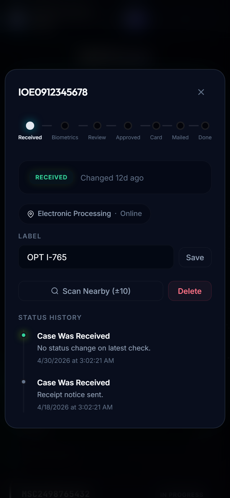

# USCIS Case Tracker

Self-hosted USCIS case-status tracker with a mobile-first dashboard, local JSON storage, scheduled checks, desktop notifications, and web push support.

I built this because I am an international student tracking my own immigration workflow. USCIS status pages are easy to forget, hard to monitor across multiple receipt numbers, and not designed for quick mobile review. This project turns that into a private dashboard I can run myself.

## Screenshots





## Features

- Track multiple USCIS receipt numbers from one dashboard
- Register/login with local password-derived user files
- Scheduled background checks with respectful delays between requests
- Case journey visualization for common forms such as I-765, I-485, N-400, and related workflows
- Desktop notifications for status changes
- Web push notifications for mobile PWA installs
- Nearby receipt scanner to estimate processing movement around a case range
- Backup and restore as JSON
- Optional read-only share link
- Local-first storage in `data/` with no external database
- Responsive dark-mode dashboard installable as a PWA

## Quick Start

### Prerequisites

- Node.js 18+
- Google Chrome installed on the host machine

```bash
git clone https://github.com/MasterSid007/Case-Tracker.git
cd Case-Tracker

npm install
npm run setup
npm start
```

Open `http://localhost:3456`, create a local account password, and add one or more receipt numbers.

If Chrome is not available, install Playwright's bundled Chromium:

```bash
npm run install-browser
```

## Configuration

Configuration lives in `.env`; runtime case data lives under `data/` and is gitignored.

| Variable | Default | Description |
|---|---|---|
| `PORT` | `3456` | Local dashboard port |
| `VAPID_EMAIL` | `admin@example.com` | Contact value used for web push VAPID details |
| `VAPID_PUBLIC_KEY` | auto-generated | Optional explicit web push public key |
| `VAPID_PRIVATE_KEY` | auto-generated | Optional explicit web push private key |

The app uses local password-derived user files rather than a central account database. Keep the `data/` directory private because it contains receipt numbers, status history, push subscriptions, and generated VAPID keys.

## How It Works

The tracker uses a dedicated Chrome profile and Playwright's Chrome DevTools Protocol connection to check USCIS status pages in a real browser session.

Flow:

1. The Express server stores cases and settings in local JSON files.
2. A scheduled job or manual refresh calls the USCIS scraper.
3. The scraper launches or reuses Chrome with a dedicated profile in `data/chrome-profile/`.
4. Playwright connects over CDP, opens the USCIS case-status page, enters the receipt number, and extracts the result.
5. If Cloudflare Turnstile or an interstitial appears, the scraper waits for the normal browser session to resolve it. If it does not resolve, the user is asked to open Chrome and complete the challenge manually once; the dedicated profile can then reuse that session state.
6. When a status changes, the app records history and sends desktop/web-push notifications if enabled.

This project does not solve CAPTCHAs or attempt to evade platform controls. It uses a real browser profile, persistent cookies, and conservative delays so the workflow behaves like a personal-use status checker.

## Architecture

```text
server.js
  -> Express API, auth, scheduler, web push
lib/scraper.js
  -> Playwright + Chrome CDP USCIS status checks
lib/storage.js
  -> local JSON persistence and password-derived user files
lib/notifier.js
  -> desktop notifications
public/
  -> dashboard SPA, service worker, PWA manifest
scripts/setup.js
  -> first-time data directory, VAPID key, and .env setup
```

## API Reference

All `/api/*` routes require the `Authorization` header set to the local account password.

| Method | Endpoint | Description |
|---|---|---|
| `GET` | `/api/cases` | List tracked cases |
| `POST` | `/api/cases` | Add a case |
| `PUT` | `/api/cases/:id` | Update a case label |
| `DELETE` | `/api/cases/:id` | Remove a case |
| `POST` | `/api/check/:id` | Check one case |
| `POST` | `/api/check-all` | Check all cases |
| `POST` | `/api/check-neighbors/:receipt` | Scan nearby receipt numbers |
| `GET` | `/api/settings` | Read settings |
| `PUT` | `/api/settings` | Update settings |
| `GET` | `/api/logs` | Read activity logs |
| `GET` | `/api/status` | Read scheduler status |
| `POST` | `/api/restore` | Restore a JSON backup |

## Remote Access

For phone access, run the tracker locally and expose it through a tunnel you control:

```bash
ngrok http 3456
```

or:

```bash
cloudflared tunnel --url http://localhost:3456
```

Use a strong local account password before exposing the dashboard beyond localhost.

## Mobile PWA

1. Open the dashboard URL on your phone.
2. Use Add to Home Screen or Install App.
3. Open Settings and enable native push notifications.
4. Leave the server running on the host machine for scheduled checks.

## Verification

Verified locally:

- `npm start` launches the dashboard on port 3456
- Register/login works with a local password-derived user file
- Restore/import path loads demo cases without hitting USCIS
- Mobile dashboard and case-detail screenshots render correctly

## Responsible Use

This is a personal-use tracker for USCIS case-status monitoring. Use reasonable intervals, avoid bulk abuse, and do not publish receipt numbers or case history. If USCIS changes its site or presents a challenge that does not resolve in the dedicated browser profile, complete it manually in Chrome and retry.

## License

MIT License. See [LICENSE](LICENSE).
